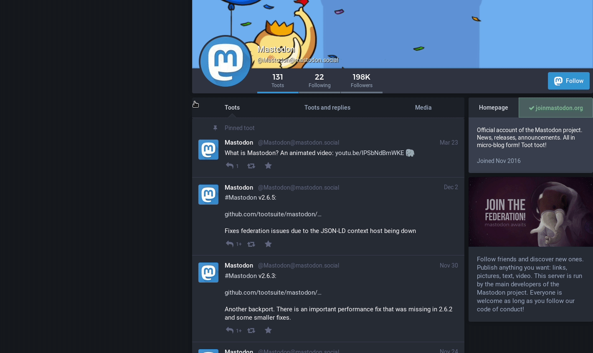

# Mastodon – Simplified Federation! 

  

Simplifies following or interacting with other users on remote Mastodon instances in the Fediverse. Basically, it skips the "Enter your Mastodon handle" popup and takes you directly to your own "home" instance, saving you from cumbrously entering your Mastodon handle again and again in that input box when you click on a “Follow”, “Retoot”/“Fav” or other remote interaction button on another instance. :smile:

[Idea by](https://social.wxcafe.net/@akkes/100550833588126733) [@akkes](https://social.wxcafe.net/@akkes).

## Download

****

## In action…

## Why?

You may wonder why to use this browser add-on. But actually, it's easy!

You do not need to enter your Mastodon account handle anymore! (except for login :wink:) This makes interacting with remote instances much simpler.

Additionally, this add-on makes sure to keep your Mastodon handle **private**. It will never expose it to any third-party site. Therefore it does not – literally – enter your Mastodon ID into the input field you normally see, but basically "skips" this page. For the technical details, on how this works, see [How does it work?](#how-does-it-work) below.

## How does it work?

1. It intercepts any remote interaction popup/request.
2. It tries to get the toot/account you want to interact with from the "Enter your Mastodon ID" popup.
  1. for remote follows: It get's the account to follow from the URL.
  2. for toot interactions:
     1. It gets the local toot ID from the URL.
     2. It sends an additional web request to the remote server to get the remote toot ID.  
       Alternatively, it does try to get the remote toot URL from the page you are loading.
3. Afterwards it redirects you to the "remote_follow"/"remote_interaction" endpoint of your own Mastodon instance directly, thus skipping entering the Mastodon handle in that "foreign" page.

Due to the fact that it does not block loading of the "Enter your Mastodon ID" popup, it may – especially in the case of "toot interactions" – happen, that the "Enter your Mastodon ID" popup is shown anyway for some seconds. After some time, it should be redirected though.
If it really fails, this behavior ensures you still have a fallback to be able to manually enter your Mastodon handle.

### Other Fediverse instances

Note this add-on also include (partially limited) support for redirecting other Fediverse instances to your Mastodon instance.
There, it may use different (or similar) methods for getting information about the user you want to follow.

Note, however, it only triggers when a redirect/loading of an URL specific to a Fediverse type occurs. As such, it e.g. cannot “intercept” small text-fields, where you can enter your handle, inside of a page.

* for GNU Social: It can get the user from the URL, if the URL is `/main/ostatus/nickname/<username>`.
* for Pleroma: TODO
